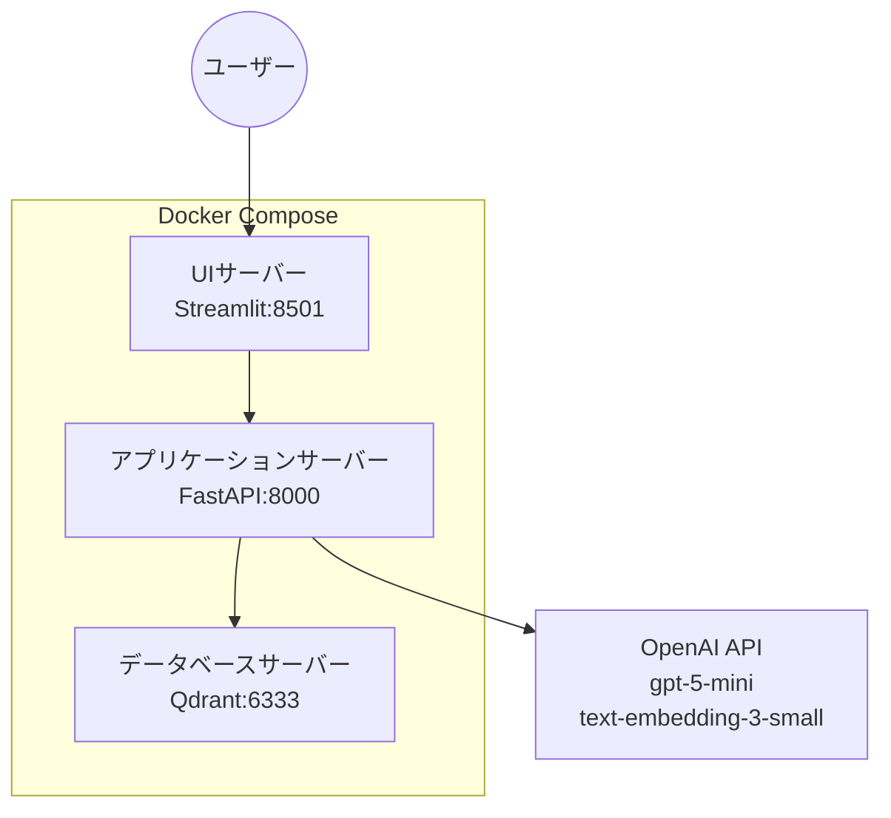
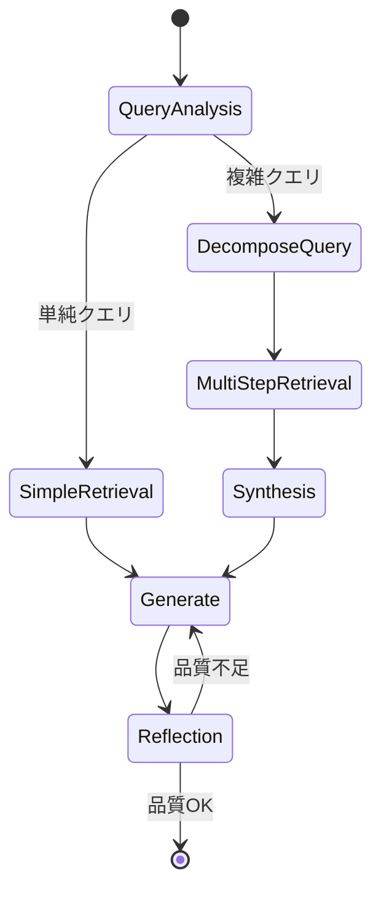

# LLMエンジニア コーディング課題: RAGシステム実装計画

## 課題概要

株式会社Laboro.AIのLLMエンジニア採用試験として、**日本語RAG評価データセット（RAG-Evaluation-Dataset-JA）** を知識源とした実践的なRAGシステムを構築する。

> [!NOTE]
> **提出期限**: 課題送付日から3週間以内  
> **API予算**: $30（gpt-5-mini + text-embedding-3-small）

---

## 技術スタック（課題要件準拠）

| カテゴリ | 選定技術 | 要件 |
|---------|---------|------|
| バックエンド | Python 3.12 | ✅ 必須 |
| フロントエンド | Streamlit | Python軽量UIフレームワーク |
| パッケージ管理 | **uv** | ✅ 必須 |
| 実行環境 | **Docker + Docker Compose** | ✅ 必須 |
| ベクトルDB | Qdrant | 軽量・Docker対応 |
| LLMフレームワーク | LangChain / LangGraph | Agentic RAG対応 |
| テキスト生成 | **gpt-5-mini** | ✅ 指定 |
| 埋め込み生成 | **text-embedding-3-small** | ✅ 指定 |
| PDF Parser | PyMuPDF + pdfplumber | 図表対応 |
| 設計原則 | **オブジェクト指向** | ✅ 必須 |

---

## アーキテクチャ設計

### マルチコンテナ構成（課題要件）



### ディレクトリ構成

```
laboro-rag-system/
├── docker-compose.yml           # マルチコンテナ定義
├── Dockerfile.api               # APIサーバー用
├── Dockerfile.ui                # UIサーバー用
├── .env.example                 # 環境変数テンプレート
├── pyproject.toml               # uv パッケージ管理
├── README.md
│
├── docs/                        # 📄 提出ドキュメント
│   ├── system_specification.md  # システム仕様書
│   ├── setup_guide.md           # 環境構築手順書
│   ├── execution_guide.md       # 実行手順書
│   └── evaluation_report.md     # 精度評価レポート
│
├── data/
│   ├── raw/                     # 元PDFファイル（5業種）
│   ├── processed/               # チャンク・埋め込み済みデータ
│   └── evaluation/              # QA評価データセット
│
├── src/
│   ├── config/settings.py       # 設定管理（Pydantic）
│   ├── ingestion/               # データ取り込み
│   │   ├── pdf_parser.py
│   │   ├── text_splitter.py
│   │   └── embedder.py
│   ├── retrieval/               # 検索
│   │   ├── vector_store.py
│   │   └── retriever.py
│   ├── generation/              # 生成
│   │   ├── llm_client.py
│   │   └── prompt_templates.py
│   ├── rag/                     # RAG実装
│   │   ├── base.py              # 抽象基底クラス
│   │   ├── naive_rag.py         # ナイーブRAG
│   │   └── agentic_rag.py       # AgenticRAG
│   ├── agents/                  # エージェント
│   │   ├── query_analyzer.py
│   │   ├── retrieval_agent.py
│   │   └── reflection_agent.py
│   └── evaluation/              # 評価
│       ├── evaluator.py
│       └── metrics.py
│
├── app/
│   ├── api/main.py              # FastAPIエントリ
│   └── ui/streamlit_app.py      # StreamlitUI
│
├── scripts/
│   ├── download_dataset.py      # データセットDL
│   ├── ingest_documents.py      # ドキュメント取込
│   └── run_evaluation.py        # 評価実行
│
└── tests/                       # テスト
```

---

## RAG実装設計

### 1. Naive RAG（ベースライン）

課題要件：「単純なテキスト分割、ベクトル検索のみ」

```python
class NaiveRAG(BaseRAG):
    """
    ナイーブRAG - 最もシンプルなRAG実装
    
    処理フロー:
    1. RecursiveTextSplitterでチャンク分割
    2. text-embedding-3-smallで埋め込み生成
    3. Qdrantでコサイン類似度検索（top_k=5）
    4. gpt-5-miniで回答生成
    """
    def query(self, question: str) -> RAGResponse:
        docs = self.retriever.search(question, top_k=5)
        context = self._format_context(docs)
        answer = self.llm.generate(question, context)
        return RAGResponse(answer=answer, sources=docs)
```

### 2. Agentic RAG（発展版）

> [!IMPORTANT]
> **Agentic RAGの独自定義**
> 
> 本課題では、Agentic RAGを以下のように定義する：
> 
> **「LLMエージェントが検索・推論・生成プロセスを自律的に制御し、クエリの複雑さに応じて動的に戦略を変更できるRAGシステム」**

#### コア機能

| 機能 | 説明 |
|------|------|
| **Query Analysis** | クエリ意図を分析し、検索戦略を決定 |
| **Adaptive Retrieval** | 複数回検索、クエリ書き換え |
| **Multi-step Reasoning** | 複雑な質問を分解し段階的に回答 |
| **Self-Reflection** | 回答品質を評価し、必要に応じて再生成 |

#### LangGraphステートマシン



---

## 評価計画

### データセット情報

- **5業種ドメイン**: 金融、IT、製造、公共、小売
- **各60問** = 合計300問
- **Context Type**: paragraph / table / image

### 評価指標（Allganize準拠）

| 指標 | 閾値 | ツール |
|------|------|--------|
| answer_similarity | 4以上 | TonicAI / MLflow |
| answer_correctness | 4以上 | MLflow / Claude |
| **最終判定** | Voting方式 | - |

### 分析観点

1. **Naive vs Agentic比較** - 精度・応答時間
2. **Context Type別精度** - paragraph/table/image
3. **業種ドメイン別精度** - 5業種の傾向分析

---

## 提出物チェックリスト

| 提出物 | ファイル | ステータス |
|--------|----------|-----------|
| ソースコード | `src/`, `app/`, `scripts/` | [ ] |
| Gitリポジトリ | `.git/`（履歴含む） | [ ] |
| システム仕様書 | `docs/system_specification.md` | [ ] |
| 環境構築手順書 | `docs/setup_guide.md` | [ ] |
| 実行手順書 | `docs/execution_guide.md` | [ ] |
| 精度評価レポート | `docs/evaluation_report.md` | [ ] |

---

## 3週間スケジュール

### Week 1: 基盤構築 + Naive RAG

| 日 | タスク |
|----|--------|
| Day 1-2 | 環境構築（Docker, uv, Git） |
| Day 3-4 | データセット取込・前処理 |
| Day 5-6 | Naive RAG実装 |
| Day 7 | UI基本実装・動作確認 |

### Week 2: Agentic RAG + 評価

| 日 | タスク |
|----|--------|
| Day 8-10 | Agentic RAG設計・実装 |
| Day 11-12 | 評価パイプライン構築 |
| Day 13-14 | 精度評価実行・分析 |

### Week 3: ドキュメント + 最終調整

| 日 | タスク |
|----|--------|
| Day 15-17 | 4ドキュメント作成 |
| Day 18-19 | コードリファクタ・テスト |
| Day 20-21 | 最終確認・zip提出 |

---

## API利用戦略

> [!WARNING]
> **$30制限対策**
> 
> - 開発中はモック/ローカルLLMでテスト
> - Embeddingは1回生成→永続化
> - 本番評価は最終段階で1回のみ実行
> - トークン使用量をリアルタイム監視

---

## 次のアクション

1. プロジェクトディレクトリ作成
2. Docker + uv環境構築
3. Git初期化
4. データセットダウンロード

**計画を承認いただければ、すぐに実装を開始します。**
